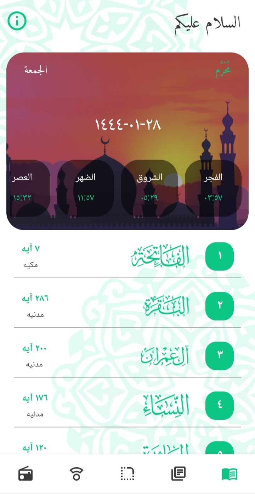
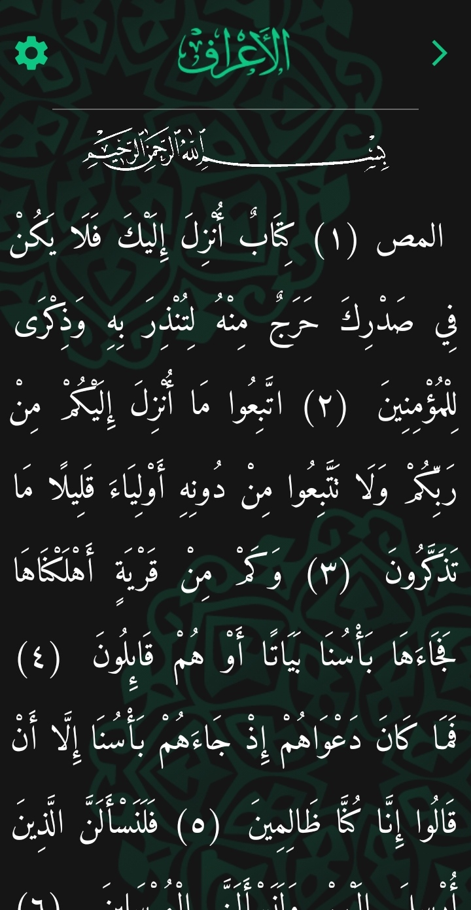
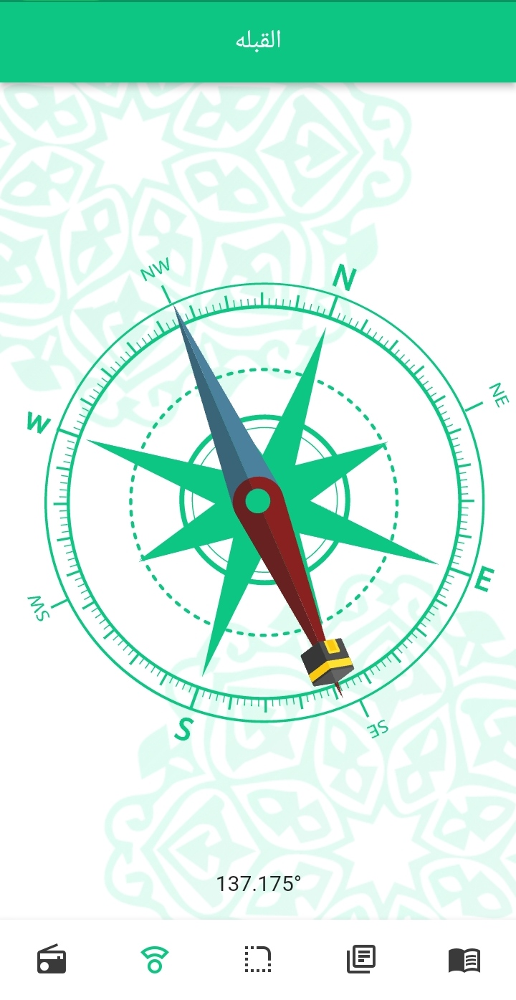
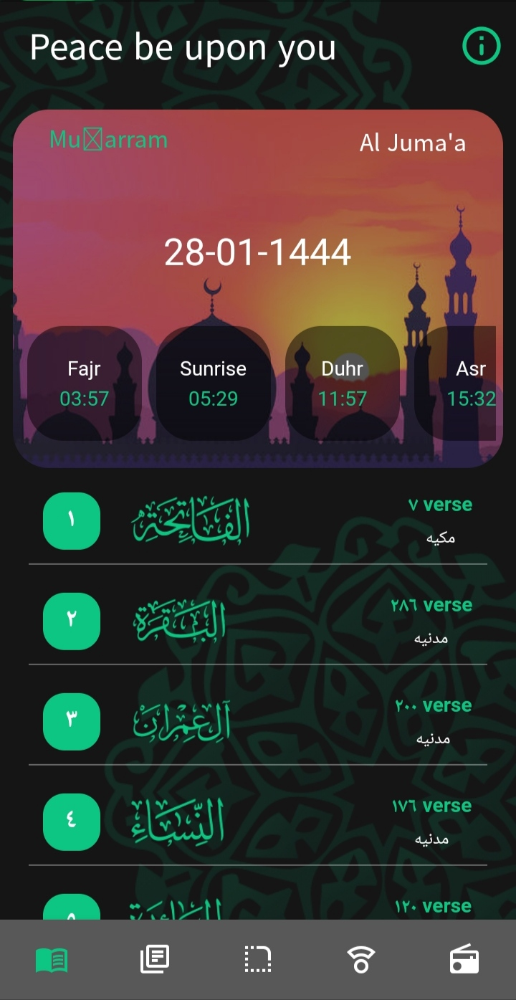
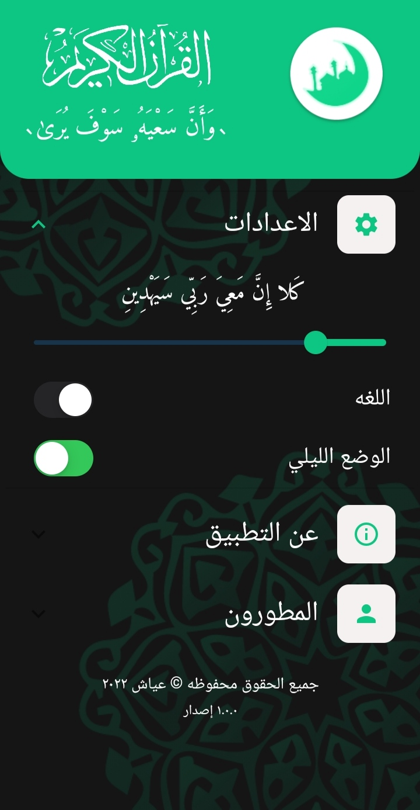
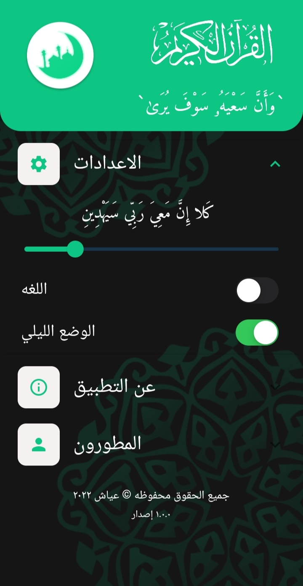
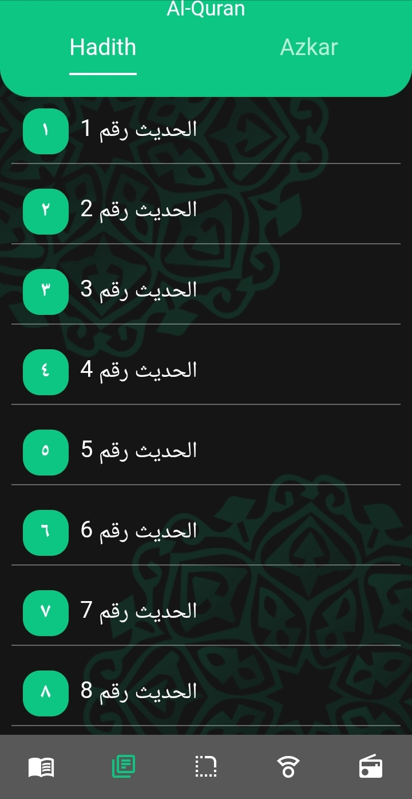
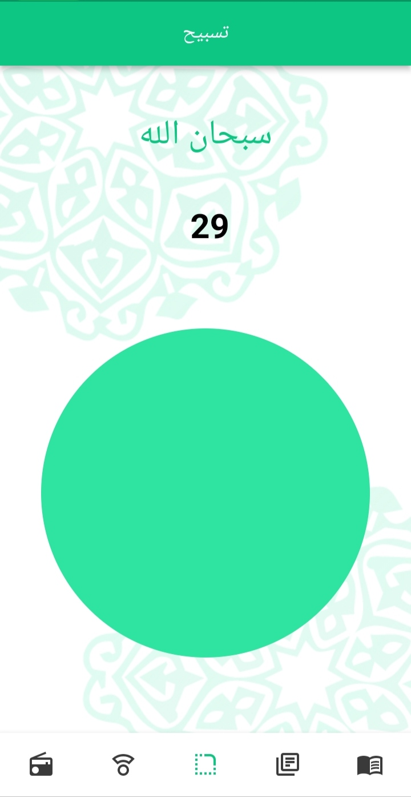
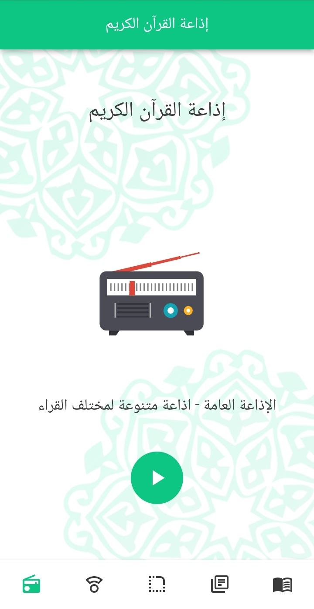
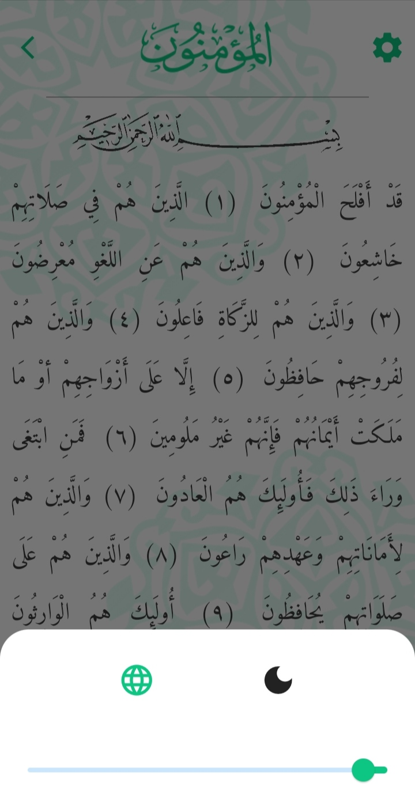

# Al Qur'an 1.0.0

Application of Holy book of Muslims, Al-Qur'an. Developed using Flutter
The application of the Holy Qur’an helps you to read the surahs and verses wherever you go and remember the times of prayer with determining the direction of the qiblah. There is also our Holy Qur’an radio station. We also give you the possibility to glorify God and display hadiths and remembrances


<div align="center">

[](#)
[](https://github.com/abdalla3yash/Al-Quran/fork)
[](https://https://github.com/abdalla3yash/Al-Quran/issues)
[](#)

</div>

## 💻 Installation steps

- Updated to `Flutter 3.0.5` Now!
- Dart SDK `2.15` with Sound Null Safety!

Open CMD where you want to clone the project & run the following commands

```
git clone https://github.com/abdalla3yash/Al-Quran.git
cd Al-Quran-main
flutter packages get
flutter run
```

## 📱 Screen Shots

   

### ☀ Dark Mode Theme

   

 

### ☀ Light Mode Theme

  
   


## 🔗 API Information

API Used: http://api.aladhan.com/v1/

## 🎯 Features Updated

✅ Offline Mode - Improved

✅ Qiblah

✅ Azkar and Hadith

✅ Radio

✅ Dark And Light Mode

## 🧑 Author

#### Abdalla Ayash
[](https://www.linkedin.com/in/abdalla-ayash)

You can also follow my GitHub Profile to stay updated about my latest projects:

[](https://github.com/abdalla3yash)

If you liked the repo then kindly support it by giving it a star ⭐!

Copyright (c) 2022 ABDALLA AYASH
